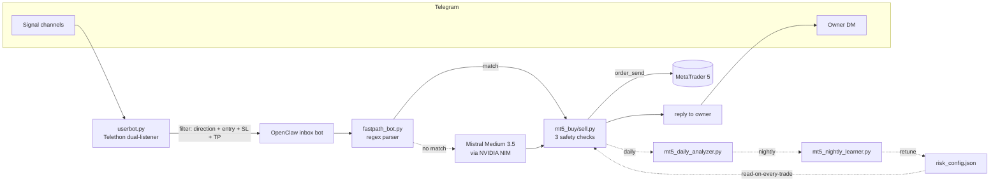

# OpenClaw Trading


> **My OpenClaw configuration: *Mistral Trader*** — a Telegram-driven
> autonomous MetaTrader 5 trade executor I built on top of the OpenClaw
> agent runtime.
>
> Every file in this repository is my own work: the custom skill, the
> Telethon signal relay, the scheduled jobs, the persona files, the
> gateway config, the tests, the benchmark, the design report.
> **OpenClaw itself is a separate upstream package** — install it first,
> then clone this repo into `~/.openclaw` (or
> `%USERPROFILE%\.openclaw\`) to reproduce my setup.

---

## What I built

| Artefact | What it is |
|---|---|
| [`workspace/skills/mt5-trading-assistant/`](workspace/skills/mt5-trading-assistant/) | Custom MT5 automation skill (~2 000 LOC Python). Zone-form order executor with three-layer safety, daily P&L reconstruction, nightly ML retraining, auto-tuned risk thresholds. |
| [`workspace/skills/mt5-trading-assistant/fastpath/`](workspace/skills/mt5-trading-assistant/fastpath/) | Regex parser + Telegram sidecar bot replacing the LLM signal pipeline. **35–140× faster** end-to-end (30 s → 0.84 s). Full design rationale and measurements in [`fastpath/REPORT.md`](workspace/skills/mt5-trading-assistant/fastpath/REPORT.md). |
| [`fastpath/test_fastpath.py`](workspace/skills/mt5-trading-assistant/fastpath/test_fastpath.py) | ~30 unit tests covering every parsing path (valid / noise / invalid / auto-flip / inference / close-all). |
| [`fastpath/bench.py`](workspace/skills/mt5-trading-assistant/fastpath/bench.py) | End-to-end timing harness (parse + MT5 exec). |
| [`scripts/test_mt5_kline.py`](workspace/skills/mt5-trading-assistant/scripts/test_mt5_kline.py) | MT5 connectivity smoke test (M1 / H1 / D1 K-lines). |
| [`scripts/daily_report_to_telegram.py`](workspace/skills/mt5-trading-assistant/scripts/daily_report_to_telegram.py) | Standalone no-LLM daily-report sender — zero tokens per run. |
| [`userbot.py`](userbot.py) | Telethon dual-listener that filters inbound Telegram signals (4-regex direction + entry + SL + TP check) and forwards survivors to the OpenClaw inbox bot. |
| [`workspace/{IDENTITY,SOUL,AGENTS,TOOLS}.md`](workspace/) | Agent persona — terse trader voice, zero-commentary execution, hard-coded volume + TP1 discipline. |
| [`cron/jobs.example.json`](cron/jobs.example.json) | Three scheduled jobs I run on this setup: daily P&L report (23:00 CET), hourly MT5 health-check, nightly learner + auto-tuner (23:30 CET). |
| [`openclaw.example.json`](openclaw.example.json) | Gateway config: NVIDIA NIM provider, Mistral Medium 3.5 128B, Telegram channel, owner allowlist. |
| `gateway.cmd`, `userbot_start.cmd`, `fastpath/start_fastpath_bot.cmd`, `scripts/daily_report.cmd` | Windows launchers — Task Scheduler-friendly, single-instance guards, auto-restart loops. |

---

## Why this project exists

Most "copy-trader" tools either (a) trust the upstream signal blindly
and blow up the account on the first stale entry, or (b) hide their
logic inside opaque GUIs. *Mistral Trader* is the explicit alternative:

- Every safety check is a readable Python branch you can audit.
- Risk thresholds live in a JSON file the **auto-tuner rewrites
  nightly** from a 7-day rolling P&L window, with hard limits and a max
  delta per night to prevent oscillation.
- The fast-path is a 200-line regex parser; you can extend it to a new
  broker or signal format in minutes. It has a 30-case test suite
  (`test_fastpath.py`) and a measurable end-to-end speed-up over the
  previous LLM-driven pipeline (`REPORT.md`).
- An optional LLM fallback (Mistral Medium 3.5 served via NVIDIA NIM)
  handles unusual phrasings so the regex layer stays small and audited.

---

## Architecture



---

## Features

- **Strict signal filter** — every Telegram message must carry a
  direction (BUY / SELL / ACHAT / VENTE), an entry zone or price, a
  stop-loss, and a take-profit. Anything else is dropped before it can
  reach the executor.
- **Zone-form orders** — every executor takes the same five arguments
  (`volume`, `zone_min`, `zone_max`, `SL`, `TP`) regardless of whether
  the signal gives a range or a single price.
- **Three pre-trade safety checks** — zone validation, anti-late-TP
  ("sniper") guard, minimum risk/reward gate. Any failure short-
  circuits with an `ABANDON …` line and no order is sent.
- **Hard volume lock** — 0.05 lots, enforced in code. Passing any other
  value warns and clamps back.
- **TP1 discipline** — when a signal carries TP1/TP2/TP3, only TP1 is
  honoured; the rest is discarded.
- **Sub-1-second fast-path** — regex parser, no LLM round-trip.
- **LLM fallback** — Mistral Medium 3.5 via NVIDIA's NIM endpoint
  handles unrecognised phrasings.
- **Daily reconstruction** — every closed trade rebuilt from MT5
  history into `trade_history/<date>.json` with W/L/BE classification.
- **Nightly retrain** — a `RandomForestClassifier` is retrained on
  every ingested feature row (M15/H1/H4 indicators + signal metadata).
  Cross-validation score logged into a `model_versions` table.
- **Auto-tuned thresholds** — `mt5_auto_tuner.py` rewrites
  `risk_config.json` from the rolling 7-day window, within hard limits
  and a per-night max delta.
- **Tested and benchmarked** — `test_fastpath.py` (~30 cases),
  `bench.py` (end-to-end timing), `test_mt5_kline.py` (MT5 connectivity
  smoke test).

---

## Reproduce on your own OpenClaw

You need a working OpenClaw install first (Node.js + the `openclaw` npm
package), plus the MetaTrader 5 desktop client and a Telegram bot.

```bash
# 1. Install OpenClaw upstream (one time)
npm install -g openclaw
openclaw setup                # creates ~/.openclaw with the framework default

# 2. Replace the default config with mine
Move-Item $env:USERPROFILE\.openclaw $env:USERPROFILE\.openclaw.backup
git clone https://github.com/djebar-rayan/openclaw-trading.git $env:USERPROFILE\.openclaw
cd $env:USERPROFILE\.openclaw

# 3. Python deps for the skill + the userbot
python -m venv .venv
.\.venv\Scripts\activate
pip install -r requirements.txt

# 4. Credentials
copy .env.example .env                                                  # fill MT5_*, TELEGRAM_*, NVIDIA_*
copy openclaw.example.json openclaw.json                                # set gateway + bot token
copy cron\jobs.example.json cron\jobs.json                              # set your Telegram chat-id
copy workspace\skills\mt5-trading-assistant\references\config_template.py `
     workspace\skills\mt5-trading-assistant\config.py                   # set MT5 login + password

# 5. Generate the device keypair + operator token
openclaw doctor --fix

# 6. Smoke-test
python workspace\skills\mt5-trading-assistant\scripts\test_mt5_kline.py
python workspace\skills\mt5-trading-assistant\fastpath\test_fastpath.py

# 7. Launch
gateway.cmd                                                             # in one terminal
python userbot.py                                                       # in another (OTP prompt on first run)
python workspace\skills\mt5-trading-assistant\fastpath\fastpath_bot.py  # in a third
```

A fresh machine reaches step 7 in under ten minutes if MT5 is already
installed. Full detail: [`docs/INSTALLATION.md`](docs/INSTALLATION.md).

---

## Project layout

```
openclaw-trading/                       ← clone target = ~/.openclaw/
├── README.md, LICENSE, NOTICE, DISCLAIMER.md, CONTRIBUTING.md
├── CLAUDE.md                           # operator instructions
├── .env.example                        # every credential the agent reads
├── .gitignore                          # blocks every runtime + secret pattern
├── requirements.txt                    # Python deps
├── openclaw.example.json               # gateway + channels + model + auth template
│
├── gateway.cmd                         # Windows launcher
├── userbot.py                          # Telethon dual-listener signal relay
├── userbot_start.cmd                   # auto-restart wrapper for Task Scheduler
│
├── cron/
│   └── jobs.example.json               # 3 scheduled jobs
│
├── docs/
│   ├── ARCHITECTURE.md                 # component + data-flow walkthrough
│   ├── INSTALLATION.md                 # step-by-step setup
│   └── CONFIGURATION.md                # every env var + JSON knob
│
└── workspace/                          # OpenClaw expects this name verbatim
    ├── IDENTITY.md, SOUL.md, AGENTS.md, TOOLS.md, USER.md.example
    └── skills/
        └── mt5-trading-assistant/      # the centrepiece — MT5 automation suite
            ├── README.md, SKILL.md, INSTALLATION.md
            ├── config.example.py
            ├── features.py             # 30-column TA indicator pipeline
            ├── risk_config.json        # auto-tuned thresholds
            ├── scripts/                # 9 entry points (buy/sell/check/snapshot/
            │                           # close/daily_analyzer/nightly_learner/
            │                           # auto_tuner/daily_report_to_telegram/
            │                           # test_mt5_kline)
            ├── fastpath/               # regex parser + Telegram bot + tests +
            │                           # bench + design REPORT
            └── references/             # config_template.py, setup_guide.md
```

---

## Safety model

The volume hard-cap, the three pre-trade checks, and the auto-tuner's
delta cap together form a layered safety model:

| Layer | Source of truth | What it prevents |
|---|---|---|
| Volume lock (0.05) | `mt5_buy.py` / `mt5_sell.py` | Account blow-up from oversized orders |
| Zone validation | `risk_config.zone_tol` | Chasing price too far from the signal zone |
| Anti-late TP | `risk_config.min_distance` | Entering when TP is so close that SL is likelier |
| Min risk/reward | `risk_config.min_rr` | Negative-expectancy entries |
| Auto-tuner deltas | `mt5_auto_tuner.py` (MAX_DELTA) | Threshold oscillation; runaway drift |
| Hard limits | `mt5_auto_tuner.py` (LIMITS) | Tuner driving a threshold out of sane range |

---

## What is NOT in this repo (and why)

This repo only ships what I authored. The following lives elsewhere:

- **OpenClaw itself** — install via `npm install -g openclaw`. The
  gateway binary, the canvas viewer, CLI completions, bundled plugin
  manifests, and the model-providers DLLs all come from the upstream
  package.
- **Runtime state directories** — `agents/`, `flows/`, `memory/`,
  `tasks/`, `logs/`, `cron/runs/`, `telegram/`, `canvas/`,
  `completions/`, `devices/`, `identity/`, `credentials/`,
  `plugins/`, `plugin-skills/` are all auto-created by
  `openclaw doctor --fix` or the gateway itself on first launch.
  They're gitignored.
- **Community / bundled skills** — anything other than
  `mt5-trading-assistant` is not my work. Install from the OpenClaw
  registry as needed:
  ```bash
  openclaw skills install <skill-name>
  ```

---

## Roadmap

- [ ] Generic broker adapter (replace direct `MetaTrader5` import
      behind an interface so cTrader / TradeLocker can plug in).
- [ ] Multi-symbol fan-out (currently configured for XAUUSD only).
- [ ] Web dashboard for the daily reports and the model-version history.
- [ ] Switch to a live broker once two consecutive months of demo come in green.
- [ ] Backtest harness that replays historic Telegram channels against
      the fast-path parser + risk gates.

---

## License

[MIT](LICENSE). Trading involves substantial risk of loss — read the
full [DISCLAIMER](DISCLAIMER.md) before connecting to a live broker.
