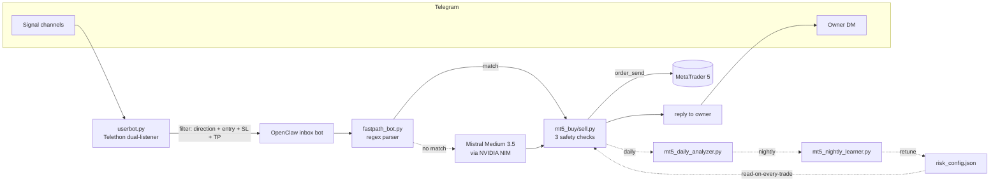

# OpenClaw Trading


> **Telegram-driven autonomous MetaTrader 5 trade executor.**
> A Telethon user-bot listens to signal channels, validates every message
> against a strict 4-field filter (direction + entry + SL + TP), and routes
> the survivors to an MT5 executor that runs three layers of safety checks
> before sending the order. End-to-end latency from signal reception to
> filled order is about **one second** on the fast-path.

---

## Why this project exists

Most "copy-trader" tools either (a) trust the upstream signal blindly and
blow up the account on the first stale entry, or (b) hide their logic
inside opaque GUIs. **OpenClaw Trading** is the explicit alternative:

- Every safety check is a readable Python branch you can audit.
- Risk thresholds live in a JSON file the **auto-tuner rewrites nightly**
  from a 7-day rolling P&L window, with hard limits and a max delta per
  night to prevent oscillation.
- The fast-path is a 200-line regex parser; you can extend it to a new
  broker or signal format in minutes.
- An optional LLM fallback (Mistral Medium 3.5 served via NVIDIA NIM)
  handles unusual phrasings so the regex layer stays small and audited.

## Architecture



## Features

- **Strict signal filter** — every Telegram message must carry a
  direction (BUY/SELL/ACHAT/VENTE), an entry zone or price, a stop-loss,
  and a take-profit. Anything else is dropped before it can reach the
  executor.
- **Zone-form orders** — every executor takes the same five arguments
  (`volume`, `zone_min`, `zone_max`, `SL`, `TP`) regardless of whether
  the signal gave a range or a single price.
- **Three pre-trade safety checks** — zone validation, anti-late-TP
  ("sniper") guard, and a minimum risk/reward gate. Any failure short-
  circuits with an `ABANDON …` line and no order is sent.
- **Hard volume lock** — 0.05 lots, enforced in code. Passing any other
  value logs a warning and clamps it back to 0.05.
- **TP1 discipline** — when a signal carries TP1/TP2/TP3, only TP1 is
  honoured; the rest is discarded.
- **Sub-1-second fast-path** — a regex parser executes known signal
  formats without any LLM round-trip.
- **LLM fallback** — Mistral Medium 3.5 (via NVIDIA's OpenAI-compatible
  NIM endpoint) handles unrecognised phrasings.
- **Daily reconstruction** — every closed trade is rebuilt from MT5
  history into `trade_history/<date>.json` with W/L classification.
- **Nightly retrain** — a `RandomForestClassifier` is retrained on every
  ingested feature row (M15/H1/H4 indicators + signal metadata). The
  cross-validation score is logged into a `model_versions` table.
- **Auto-tuned thresholds** — `mt5_auto_tuner.py` rewrites
  `risk_config.json` from the rolling 7-day window, within hard limits
  and a per-night max delta.

## Quick start

```bash
# 1. Clone
git clone https://github.com/djebar-rayan/openclaw-trading.git
cd openclaw-trading

# 2. Python deps in a fresh venv
python -m venv .venv
.\.venv\Scripts\activate          # Windows
# source .venv/bin/activate       # macOS / Linux
pip install -r requirements.txt

# 3. Credentials
cp .env.example .env
# Edit .env: fill MT5_*, TELEGRAM_*, NVIDIA_API_KEY, GATEWAY_AUTH_TOKEN

# 4. MT5 desktop client: launch it, log in, press F7 to enable AutoTrading

# 5. Smoke-test the MT5 side
python mt5-trading-assistant/scripts/mt5_check.py

# 6. Start the signal relay (will prompt for OTP on first run)
python userbot.py

# 7. In another terminal: start the Telegram fast-path bot
python mt5-trading-assistant/fastpath/fastpath_bot.py
```

A fresh machine reaches step 7 in under ten minutes if MT5 is already
installed.

## Project layout

```
openclaw-trading/
├── userbot.py                       # Telethon dual-listener signal relay
├── mt5-trading-assistant/           # MT5 executor + analyzer + learner
│   ├── scripts/                     # 9 Python entrypoints
│   ├── fastpath/                    # regex parser + Telegram bot
│   ├── features.py                  # 30-column indicator pipeline
│   ├── risk_config.json             # live thresholds (auto-tuner rewrites)
│   ├── config.example.py            # env-driven MT5 credentials
│   ├── SKILL.md / INSTALLATION.md / README.md
│   └── references/
├── config/
│   ├── openclaw.example.json        # gateway + agent config template
│   └── persona/                     # IDENTITY / SOUL / AGENTS / TOOLS
├── docs/
│   ├── ARCHITECTURE.md              # in-depth component + data-flow doc
│   ├── INSTALLATION.md              # step-by-step setup
│   └── CONFIGURATION.md             # every env var explained
├── .env.example
├── requirements.txt
├── CONTRIBUTING.md
└── LICENSE
```

See [`docs/ARCHITECTURE.md`](docs/ARCHITECTURE.md) for the deep dive,
[`docs/INSTALLATION.md`](docs/INSTALLATION.md) for the full setup
checklist, and [`docs/CONFIGURATION.md`](docs/CONFIGURATION.md) for the
complete environment-variable reference.

## Safety model

The volume hard-cap, the three pre-trade checks and the auto-tuner's
delta cap together form a layered safety model:

| Layer | Source of truth | What it prevents |
|---|---|---|
| Volume lock (0.05) | `mt5_buy.py` / `mt5_sell.py` | Account blow-up from oversized orders |
| Zone validation | `risk_config.zone_tol` | Chasing price too far above/below the signal zone |
| Anti-late TP | `risk_config.min_distance` | Entering when the TP is so close that SL is likelier |
| Min risk/reward | `risk_config.min_rr` | Negative-expectancy entries |
| Auto-tuner deltas | `mt5_auto_tuner.py` (MAX_DELTA) | Threshold oscillation; runaway drift |
| Hard limits | `mt5_auto_tuner.py` (LIMITS) | Tuner driving a threshold out of sane range |

## Roadmap

- [ ] Generic broker adapter (replace direct `MetaTrader5` import behind
      an interface so cTrader / TradeLocker can plug in).
- [ ] Multi-symbol fan-out (currently configured for XAUUSD only).
- [ ] Web dashboard for the daily reports and the model-version history.
- [ ] Switch to a live broker once two consecutive months of demo come in
      green.
- [ ] Backtest harness that replays historic Telegram channels against
      the fast-path parser + risk gates.

## License

[MIT](LICENSE). Trading involves substantial risk of loss — see the
LICENSE for the full disclaimer.
